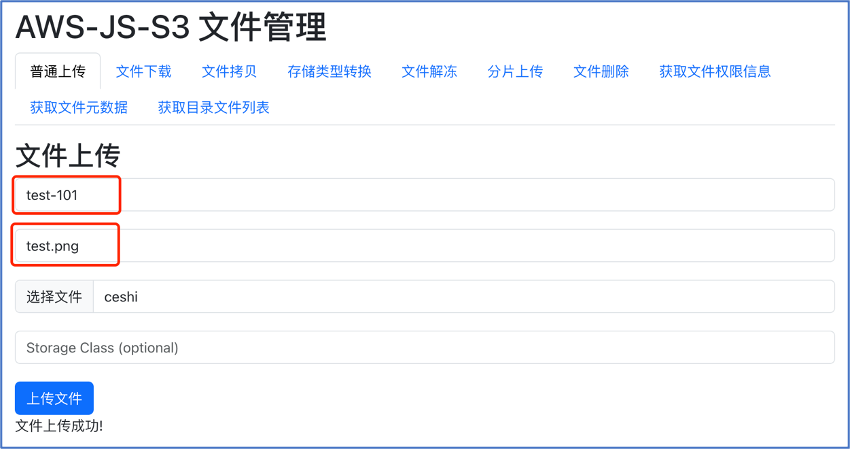

## 快速运行 SDK 示例
### 1. 准备工作
1. 登录[对象存储控制台](https://console.ucloud.cn/ufile/ufile)，创建存储空间。获取存储空间名称和存储空间域名。
2. 登录[账号管理控制台](https://console.ucloud.cn/uaccount/api_manage)，获取您的项目公钥和私钥。
3. 配置CORS 规则，来源Origin可以按需配置，Allow-Header 需配成*，Expose-Headers 需要 ETag、Content-Length 以及其他 js 需要读取的 header 字段，如下图所示。操作详情请参见[设置跨域访问](https://docs.ucloud.cn/ufile/guide/cors)文档。

### 2. 配置s3客户端文件
  确保已完成跨域设置，进入src/utils文件夹，修改s3Client.js 文件


import { S3Client } from "@aws-sdk/client-s3";

const s3 = new S3Client({
    endpoint: "",  // http://s3-cn-sh2.ufileos.com
    region: "",    // cn-sh2
    signatureVersion: 'v4',
    credentials: {
        accessKeyId: "",
        secretAccessKey: "",
    },
    forcePathStyle: true,   // 路径风格
});

export default s3;



* 参数说明

| 参数名            | 参数描述                                                                 | 类型     | 是否必填 |
| ----------------- | ----------------------------------------------------------------------- | -------- | -------- |
| accessKeyId       | UCloud 的 API 公钥或者是 US3服务提供的 Token 公钥                       | String   | 是        |
| secretAccessKey   | UCloud 的 API 私钥或者是 US3服务提供的 Token 私钥                       | String   | 是        |
| endpoint          | 访问域名，具体可参考[AWS S3 协议支持说明](https://docs.ucloud.cn/ufile/s3/s3_introduction)                                 | String   | 是        |
| region            | 存储空间所在地域                                                       | String   | 是        |
| signatureVersion  | AWS签名版本，默认使用签名版本 4 来验证请求                             | String   | 否        |
| forcePathStyle    | 使用路径风格或虚拟主机风格，具体参考[AWS S3 协议支持说明](https://docs.ucloud.cn/ufile/s3/s3_introduction)                | Boolean  | 否        |

### 3. 运行示例


$ npm start   # 启动示例


 
	以普通上传为例，必须的输入参数为配置文件对应地域下的Bucket Name，以及需要保存在该Bucket 下的Key Name (即文件名) ，存储类型默认为标准存储。若要指定存储类型，参照[S3存储类型](https://docs.ucloud.cn/ufile/s3/s3_introduction)，确认完输入信息后点击上传文件。
	如果浏览器控制台出现了CORS 相关的错误信息，请检查是否正确完成跨域配置。

### 注意
* PutObject 目前仅支持 5GB 大小文件，如果需要上传大于 5GB 的文件，请采用分片上传的 API
* PostObject 目前仅支持最大 32MB 文件的上传
* CopyObject 目前仅支持最大 5G文件的拷贝
* UploadPart 目前仅支持 8MB 定长分片大小（最后一个分片允许小于 8MB）。若有不定长分片的需求，请联系技术支持
* US3 S3 对 AWS S3 兼容的存储类型及其转换规则参考 存储类型转换规则
* US3 的 ETag 计算方式与 AWS S3 存在部分差异，建议不依赖该 ETag
* 目前不支持 S3 API 的 MD5 校验，建议关闭
* US3 的访问权限（ACL）定义与 AWS S3 存在差异，具体参考 访问权限定义（ACL）
* 目前不支持多版本功能（Versioning）
* 目前不支持标签功能（Tagging）
* ListObjects请求中的max-keys参数(请求返回对象的最大数量)最大值为5000
* 更详细的内容请查看 [AWS S3 协议支持说明](https://docs.ucloud.cn/ufile/s3/s3_introduction)

