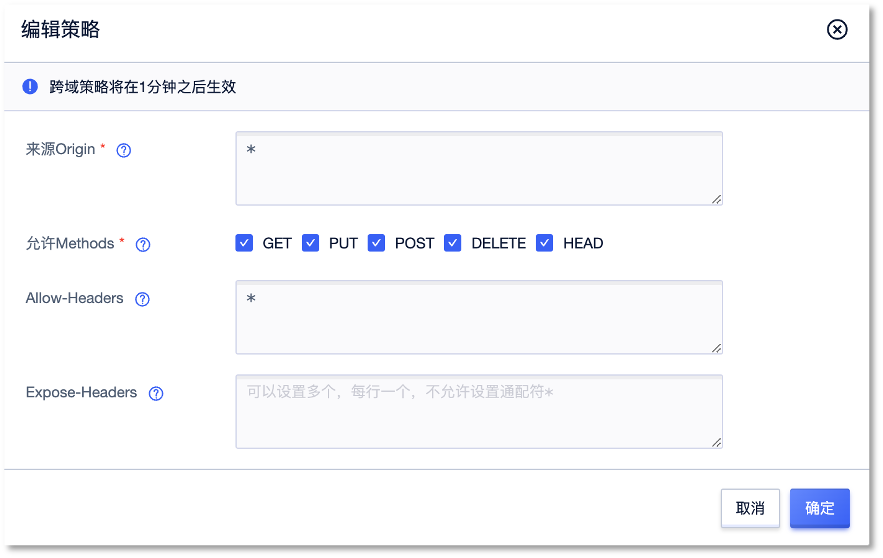

## 快速运行 SDK 示例
### 1. 准备工作
1. 登录[对象存储控制台](https://console.ucloud.cn/ufile/ufile)，创建存储空间。获取存储空间名称和存储空间域名。
2. 登录[账号管理控制台](https://console.ucloud.cn/uaccount/api_manage)，获取您的项目公钥和私钥。
3. 配置CORS 规则，来源Origin可以按需配置，Allow-Header 需配成*，Expose-Headers 需要 ETag、Content-Length 以及其他 js 需要读取的 header 字段，如下图所示。

### 2. 配置s3客户端文件
  确保已完成跨域设置，进入src文件夹，修改.env 文件


accessKeyId=
secretAccessKey=
region=cn-bj
endpoint=http://s3-cn-bj.ufileos.com
signatureVersion=v4
forcePathStyle=true



* 参数说明

| 参数名            | 参数描述                                 | 类型     | 是否必填 |
| ----------------- |--------------------------------------| -------- | -------- |
| accessKeyId       | UCloud 的 API 公钥或者是 US3服务提供的 Token 公钥 | String   | 是        |
| secretAccessKey   | UCloud 的 API 私钥或者是 US3服务提供的 Token 私钥 | String   | 是        |
| endpoint          | 访问域名，具体可参考 AWS S3 协议支持说明             | String   | 是        |
| region            | 存储空间所在地域                             | String   | 是        |
| signatureVersion  | AWS签名版本，默认使用签名版本 4 来验证请求             | String   | 否        |
| forcePathStyle    | 使用路径风格或虚拟主机风格，具体参考 AWS S3 协议支持说明     | Boolean  | 否        |

### 3. 运行示例

首先确保已完成SDK示例的本地安装。
以文件上传为例，必须的输入参数为配置文件对应地域下的`bucketName`，需要保存在该Bucket 下的`keyname` (即文件名) ，以及待上传的文件的本地路径`filePath`，存储类型默认为标准存储。若要指定存储类型，参照**S3协议支持说明**，确认完输入信息后点击上传文件。


$ cd src/
$ php Upload.php <bucketName> <keyName> <filePath> [storageClass]



如果浏览器控制台出现了CORS 相关的错误信息，请检查是否正确完成跨域配置。

### 注意
* PutObject 目前仅支持 5GB 大小文件，如果需要上传大于 5GB 的文件，请采用分片上传的 API
* PostObject 目前仅支持最大 32MB 文件的上传
* CopyObject 目前仅支持最大 5G文件的拷贝
* UploadPart 目前仅支持 8MB 定长分片大小（最后一个分片允许小于 8MB）。若有不定长分片的需求，请联系技术支持
* US3 S3 对 AWS S3 兼容的存储类型及其转换规则参考 存储类型转换规则
* US3 的 ETag 计算方式与 AWS S3 存在部分差异，建议不依赖该 ETag
* 目前不支持 S3 API 的 MD5 校验，建议关闭
* US3 的访问权限（ACL）定义与 AWS S3 存在差异，具体参考 访问权限定义（ACL）
* 目前不支持多版本功能（Versioning）
* 目前不支持标签功能（Tagging）
* ListObjects请求中的max-keys参数(请求返回对象的最大数量)最大值为5000
* 更详细的内容请查看 AWS S3 协议支持说明

